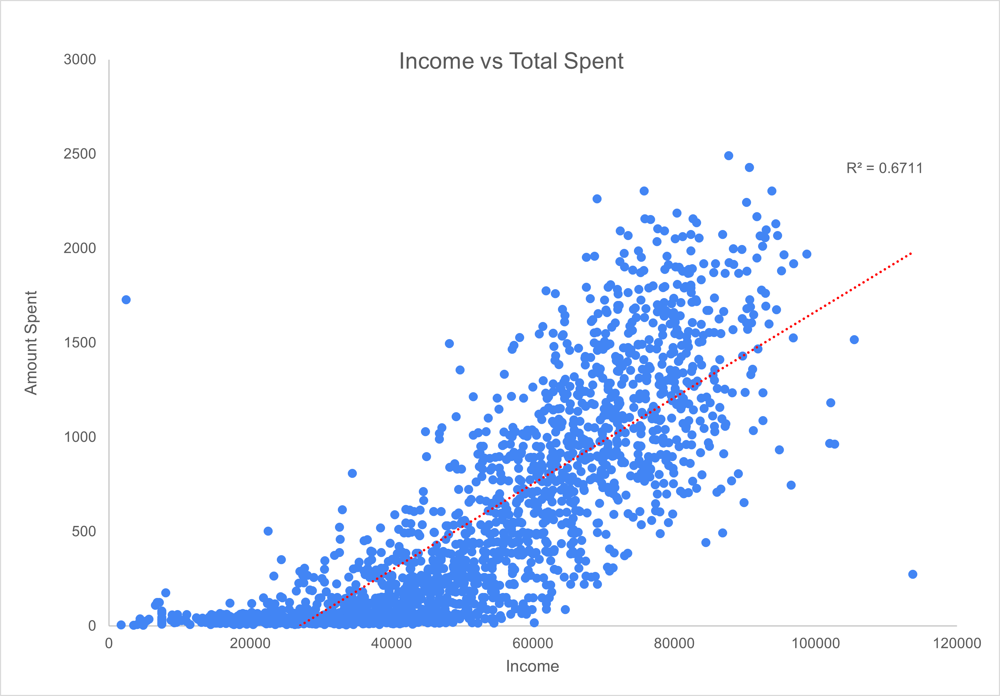
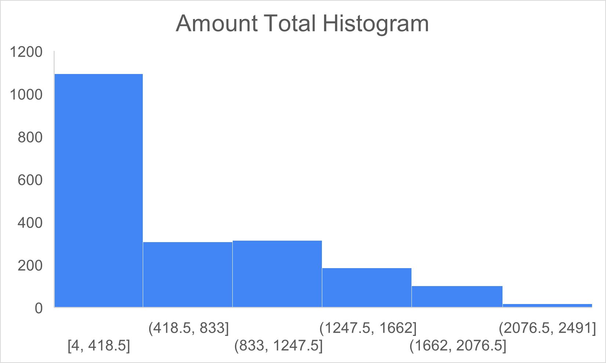

## What Massachusetts' Education Data Tells Us About Graduation Rates

**Software : Tableau**

When I first started analysing education data, I was surprised by the staggering number of students who didn't graduate. Over **162,000** young people in **Massachusetts** faced this reality, while more than **791,000** successfully completed their high school journey. These numbers made me reflect deeply

#### Tableau Dashboard

<video width="640" height="360" controls>
  <source src="[https://yourhost.com/path-to-video.mp4" type="video/mp4](https://www.loom.com/share/548ad8b149f543cab7cbda446fd036a1?sid=85ac7d2b-c3dc-436a-bc9f-5e373e24ebcd)">
</video>

### Why THIS Project?

As someone who relies on food delivery due to my hectic schedule, I’ve always been fascinated by how food delivery companies run their promotional campaigns, especially since I often see them targeting new users with exciting discounts. My interest grew when I noticed that many of my friends and colleagues would use these promotions only to return to their old habits afterward. I wanted to find out if these campaigns truly make a lasting impact or just create a quick spike in orders. So, I decided to dig into the data and see what I could find.

In this article, you'll learn about the effectiveness of DoorDash's promotional strategies based on my analysis. I’ll share key insights about customer spending behaviors, the demographics that drive revenue, and how businesses can better target their marketing efforts based on what the data shows

### Key Takeaways:

- **Campaign 6** drew in higher-value customers who spent **63% more** than average.
- Only **15%** of customers responded to this campaign, indicating there's room for growth.
- **Higher-income customers** are more likely to spend more, highlighting a target market.
- A **small group** of customers contributes significantly to total revenue, while the **majority spend modestly**.

### Dataset Details:

The dataset I analysed comes from a case study originally used in an iFood interview, which I found on GitHub. It contains 2,206 rows and 36 columns, detailing various customer attributes such as age, income, total spending, and registration dates. This dataset was perfect for my project as it provided a comprehensive view of customer behavior, allowing me to see how promotions influence their spending.

### Analysis Process:

I started by cleaning the dataset to remove any inconsistencies, ensuring the data was ready for analysis. Using Excel, I created various visualisations to uncover spending patterns and relationships. One surprising finding was that only 15% of customers engaged with Campaign 6, yet they drove such significant revenue. This led me to think about marketing strategies and how they could be adjusted to reach more customers effectively.

### Visuals and Insights:

#### Campaign 6 Performance vs. General Customer Base

The analysis shows that while Campaign 6 attracted fewer customers (311), they spent 63% more on average compared to the general customer base. This indicates an opportunity for businesses to convert more customers to this higher-spending model

The chart shows customer acquisition peaks in **January**, **March**, **July**, and **August**, likely due to effective campaigns or seasonal trends. In contrast, **November** and **December** have the lowest numbers, suggesting room for improved engagement. Mid-year months show steady growth. Overall, the data highlights key periods of success and opportunities for targeted improvements.

#### Income vs. Total Spent (Scatter Plot)

This scatter plot shows a strong positive correlation **(R² = 0.67)** between customer income and spending. It confirms that higher-income customers are more likely to spend more. For businesses, this means marketing efforts should focus on individuals with incomes above $60,000, who are likely to contribute more revenue.

#### Histogram Analysis: Customer Spending Distribution

The histogram reveals a steep drop-off in customer spending. Most customers spend between $4 and $833, with only a small fraction reaching higher tiers. This shows that while many customers make frequent orders, a select few drive most of the revenue. A focus on encouraging moderate spenders to increase their order sizes could be beneficial.

#### Customer Spending by Number of Children Analysis 

I found that child-free customers tend to spend five times more than parents. With 207 child-free customers and a total spending of $260,428, it’s clear they form a premium segment worth targeting. This insight suggests that marketing campaigns could be tailored specifically to appeal to these customers.

### Main Takeaways:

- **Campaign 6 Works** – It successfully attracts customers who spend significantly more.
- **Untapped Potential** – With only 15% of customers responding, there’s considerable opportunity to engage a larger audience.
- **Data-Driven Strategy** – Understanding income and family status can help in targeting the right customers more effectively.
- **Quick Wins Available** – Small changes, like offering VIP perks for top spenders, could quickly enhance revenue.

### Conclusion and Personal Reflections:

This analysis taught me a lot about the importance of data in driving business decisions. One challenge I faced was determining which visualisations would best convey my findings, but with some trial and error, I found ways to make the data clear and engaging. This project has shifted my perspective on how businesses can utilise customer data to refine their marketing strategies. I’m excited to see how these insights can be applied in future projects.

For more details see [Data Set](https://guides.github.com/features/mastering-markdown/).
