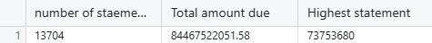
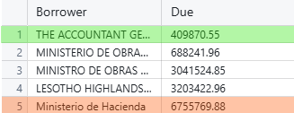

## Unpacking IDA Loans: Insights from the World Bank Data
#### Software : SQL

When I first delved into the world of international loans, I had no idea how surprising the insights could be. Picture this: huge sums of money being lent to countries all around the globe, each transaction telling a story of development, struggle, and hope. This project allowed me to explore this world through data from the World Bank, focusing on their International Development Association (IDA) credits and grants.

### Why THIS Project?

My motivation for this project stemmed from a personal interest in understanding how financial support from the World Bank affects countries in need. The IDA plays a crucial role in providing low-interest loans and grants to countries that require assistance in developing their infrastructure and economies. I wanted to see who benefits from this system and how effectively the funds are being used. Diving into this data felt like peeling back the layers of a complex puzzle, and I was eager to see what I would find.

### What Readers Will Gain

As you read through this article, you’ll learn about the most significant loan recipients, the countries that are utilizing their loans effectively, and some surprising trends in the data. My hope is to provide you with insights that shed light on how international lending works and the importance of responsible borrowing and repayment.

### Key Takeaways

- **India** has the **highest debt** – over **$793 million** from **58,339 loans**.
- **Tanzania** is the **most recent country** to **repay its loans**.
- There are **over 1 million transactions**, showing strong global use of **IDA loans**.
- **Nicaragua** stands out with a **massive loan total** of nearly **$85 billion**.
- There’s a **big gap between top and low borrowers**, reflecting **varying development needs** across countries.

### Dataset Details

For this project, I used a dataset sourced from the World Bank, specifically focusing on the IDA's credits and grants as of November 2022. This data provided a clear snapshot of the borrowing landscape across various countries. It was crucial to ensure that the data was both comprehensive and representative of the trends I wanted to explore.

The origin of the data can be found [here](https://financesone.worldbank.org/ida-statement-of-credits-grants-and-guarantees-historical-data/DS00976).

### Analysis Process & Key Insights

I began my analysis by **querying the data using SQL**. My queries focused on identifying patterns in **loan amounts**, **repayment rates**, and **transaction counts**.One surprising finding was the **high level of activity** with **over 1 million transactions**, many countries showed a strong commitment to development through IDA loans. When I examined **Nicaragua**, I nearly fell off my chair at the total loan amount **nearly $85 billion**! 

This raised an important question in my mind:  
**Should there be a cap on how much a single country can borrow?**

### Visual and Insights

#### Total transaction

It's impressive to see the level of activity with 1,109,994 transactions currently recorded. This suggests that countries are actively investing in development and exploring opportunities for growth.

#### Nicaragua

When examining Nicaragua's data, I was astounded to find that the total of all their loan amounts approaches a staggering $85 billion. It raises the question of whether there's a cap on the amount that can be borrowed. If there isn't a limit, perhaps there should be one in place.

#### The top and bottom 5 for the transaction amount

One of the most intriguing tasks was grouping transactions by country, focusing on the top and bottom five in terms of transaction amounts. From this analysis, I discovered that regions like Ukraine, Southeast Asia, and the Middle East are not utilizing the IDA significantly. It's clear that Southeast Asia and the Middle East are broad categories, and breaking them down into individual countries could provide more insights. As previously noted, India leads with the highest number of transactions.

#### The 5 lowest loan amounts by the borrower

While examining the five lowest loan amounts by borrowers, I noticed a significant disparity between the smallest and largest loan figures. This gap is striking and suggests there may be underlying factors worth investigating further to understand why such a divergence exists among borrowers.

### Main Takeaways

- **India emerges as the clear leader in borrowing**, but this raises questions about **sustainability** and the **long-term implications** of such high debt levels.  
- The **activity level among borrowers** suggests a **willingness to invest in development**, but also invites **scrutiny** over how these funds are being utilized.  
- The **disparity in borrowing amounts among countries** indicates that there is **much more to investigate** regarding the **needs and capabilities of different regions**.

### Conclusion and Personal Reflections

This project taught me so much about the **dynamics of international finance** and the **significant impact of loans on development**. One of the biggest challenges was understanding the **vast differences in how countries manage their debt**. I was surprised to find such a **wide gap between the highest and lowest borrowers**. This experience has **fueled my curiosity** to explore this topic further and consider how **financial institutions can better support nations in need**.

### Call To Action

I’d love to hear your thoughts on this topic! Feel free to connect with me on LinkedIn, share your insights, or ask any questions you may have about my findings. Let’s keep the conversation going!

