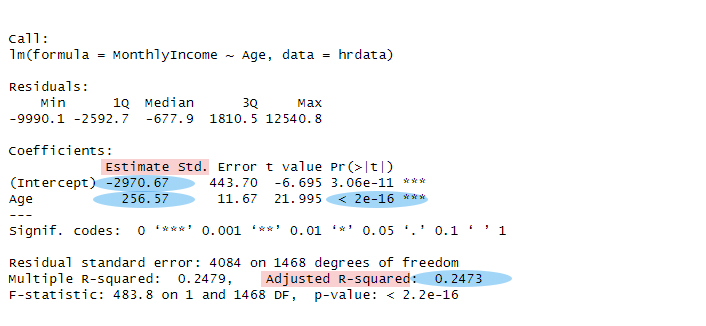

## Why Are Your Employees Leaving? Uncovering the Patterns Behind Attrition
#### Software : R

**The original dataset can be found** [here](https://www.kaggle.com/datasets/pavansubhasht/ibm-hr-analytics-attrition-dataset).

Statistics can sometimes feel like a maze, but they can also shine a light on the realities of workplace dynamics. I remember the first time I looked at a dataset and thought, “Wow, there’s so much to learn here!” This project was a journey into understanding why some employees leave while others stay. As I explored the world of HR analytics using the IBM dataset, I found some surprising truths that I can’t wait to share.

### Why THIS Project?

I chose this project because I have always been curious about employee engagement and retention. Having witnessed friends and colleagues leaving jobs for various reasons, I wanted to dig deeper into the data. The idea of using statistics to unravel the mystery of attrition felt both intriguing and important after all, retaining talent is crucial for any organization.

### What Readers Will Gain

By reading this article, you’ll gain insights into the factors driving employee attrition within organizations. You’ll learn about key patterns and trends, understand how **different roles and demographics impact retention**, and discover practical suggestions that could help improve employee satisfaction.

### Key Takeaways

- **Experienced employees with shorter tenure** are more **likely to quit**.
- **Pay dissatisfaction** significantly **affects attrition rates**.
- **Sales roles** have the **highest turnover**, indicating a need for targeted retention strategies.
- **Longer commutes** increase the **likelihood of employees leaving**, suggesting a need for flexible work options.

### Dataset Details

The dataset I used comes from **IBM** and focuses on employee attrition and performance. It includes various factors like age, tenure, job role, and satisfaction ratings. This fictional dataset is rich in details, making it ideal for examining employee dynamics and understanding what drives people to leave or stay.

### Visual and Insights

#### Correlation to Action

These correlation numbers reveal how different job factors relate to each other. The strongest pattern? **Age** and **total working years** show a high negative correlation **(-0.68)**, meaning older employees tend to have fewer years at the company which could signal retention issues with experienced staff. Meanwhile, **monthly income** has little connection to **education (0.09)** or **training (0.008)**, suggesting raises aren't strongly tied to skills development. The most surprising finding? Distance from home barely affects anything (all correlations near zero), meaning remote workers and office commuters perform similarly. This helps pinpoint where HR policies might need adjustment.

**These correlations pinpoint attrition drivers**: Experienced staff (high age, low tenure) are leaving, and pay isn't tied to skills. This shows exactly where to focus retention efforts.

#### Scatterplot Matrix

This scatterplot matrix reveals some interesting connections between **income, age, experience, and education**. We can see that both age and total working years tend to increase with higher monthly income, which makes sense people generally earn more as they gain experience. Education also **shows a positive link to income**, though it's not quite as strong. The most striking pattern? Income growth seems to flatten out after a certain point in both age and experience, suggesting there might be a salary ceiling in our organization that even more years or education don't necessarily break through. This could help us understand where compensation might need adjustment to better reward long-term employees.

**Studying this matrix first helps me spot what's normal (like pay rising with experience) so I can better identify real red flags in attrition data later.**

#### Age vs. Attrition

We wanted to check if age plays a role in who stays or leaves our company. By looking at age distributions across groups and running statistical tests, we found clear evidence that **younger employees** were significantly more **likely to leave than older ones**. The numbers show this isn't random, there's less than a 1 in a million chance this pattern happened by accident. While this might seem to go against common assumptions about age bias, it actually raises important questions we need to explore further about why our younger employees are leaving at higher rates.

Ok now we ran a t-test to check if the age difference between our groups was real, and boy, is it ever! The **'yes'** group **averages 33.6 years** old while the 'no' group sits at **37.6** , that's a solid 4-year gap. With a p-value of basically zero **(0.0000000138)**, we can say with complete confidence **this isn't random chance**. The numbers don't lie, whatever 'yes' represents (quitting, promotions, etc.), **age is definitely playing a big role here**. This is the kind of clear pattern that demands a closer look at what's really going on.

#### Surprise! Employee Tenure Doesn’t Predict Who Stays or Leaves

Turns out, using employee ID numbers as a tenure tracker didn't reveal what we expected. While lower numbers did represent the long-timers and higher numbers the new hires, the data showed **no real pattern in who leaves**. That high p-value basically told us tenure (whether someone's been here 2 months or 20 years) doesn't actually move the needle on attrition.

Honestly, this surprised me, I figured our veterans would be sticking around while newbies might jump ship. But the numbers don't lie. This finding forces us to look beyond simple tenure when trying to understand retention. Maybe it's **not about how long someone's been in the company, but why they stay**.

#### Monthly Income by Age: Where Attrition Hits Hardest

This linear regression shows a clear paycheck pattern: for every year older an employee is, their monthly income rises by about **$256**. While this makes sense (experience pays), the model only explains **25%** of pay variation **(R²=0.247)** , meaning age alone doesn't tell the full salary story. The tiny **p-value (<2e-16)** confirms this link is real, but that **$2,970 negative intercept** raises eyebrows: it suggests hypothetical 20 year olds would owe the company money, which hints we're missing key factors like education or job role. Bottom line? Age matters for pay, but we need to layer in other variables to get the true picture.

The **red dots (employees who left)** reveal a troubling pattern: they cluster disproportionately at lower income levels across all ages. Even among older workers where pay typically rises, those who quit were often earning below their peers. This suggests compensation dissatisfaction may be driving attrition regardless of age and that our salary structure isn't retaining talent effectively.

#### Income Patterns Across Career Stages

Now we're getting somewhere! This improved model shows total working years is the real salary driver **(+$489/month per year)**, while age actually has a slight negative effect **(-$27/month)**. Together they explain 60% of pay variation **(up from 25% with age alone)**. The kicker? That negative age coefficient suggests we might be underpaying some experienced older hires a red flag for retention. Bottom line: Reward experience, but audit how we compensate older workers to prevent leaks.

Here's the clear pattern: **Bigger bubbles (higher earners)** rarely turn red proving **good pay keeps people**. But the red dots we do see at large sizes expose a dangerous exception: experienced employees (30-50 yrs, 10-20 working years) quitting despite high salaries, likely because peers with similar tenure earn even more. Retention isn’t just about absolute pay it’s about feeling valued relative to your peers.

#### Attrittion Count by Job Role

Okay, The bar graph just dropped some truth bombs about who's really walking out the door. Lab techs? Bad. But sales reps? Yikes, we're losing more than half of them! That's not just a red flag, that's the whole dang fire alarm going off.

Now the **real question is**: Is this just how sales roles work everywhere, or are we doing something that's literally pushing people out the door? Before we can fix it, we need to figure out if this is an **'us' problem** or just **how the industry works**. Either way, we can't ignore that kind of turnover if we want to keep the lights on.

#### The Impact of Commute Distance on Attrition

Let's be honest nobody enjoys their daily commute. But could it actually be driving employees away? I decided to dig into the data to find out. Using a box plot visualization and running a T-test analysis, I examined whether commute times had a real impact on employee attrition.

The numbers don't lie there's a clear pattern here. The statistical analysis showed a significant difference **(with a p-value below 0.05)**, meaning we can confidently say **commute length matters**. When you look at the box plot, it's obvious employees with longer trips to work tend to leave the company more often than those who live closer.

What does this mean in plain terms? Basically, **the further someone has to travel to work, the more likely they are to quit**. It makes perfect sense when you think about it spending hours in traffic or packed trains every day can really wear people down. For companies looking to keep their talent, this is definitely something worth considering. Maybe offering remote work options or helping with relocation could make a real difference in retention rates.

### Main Takeaways:

- The correlation between age and tenure suggests that older employees may need additional support to encourage them to stay.
- Pay dissatisfaction is a key factor in attrition, indicating a need to reassess salary structures.
- High turnover in sales roles calls for targeted interventions to improve retention.
- The impact of commute distance on attrition highlights the potential benefits of flexible working arrangements.

### Conclusion and Personal Reflections:

This project taught me the importance of looking beyond surface-level metrics like tenure when analyzing employee retention. I faced challenges, especially when the data contradicted my assumptions, but those surprises led to deeper insights about workplace dynamics. Going forward, I plan to explore how companies can create more supportive environments that encourage employees to stay.

### Call To Action:

I’d love to hear your thoughts on employee retention. Do you have any experiences or insights to share? Feel free to connect with me on LinkedIn or drop your comments below!

